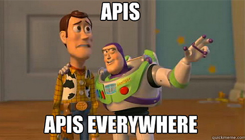
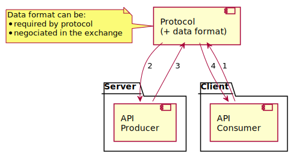
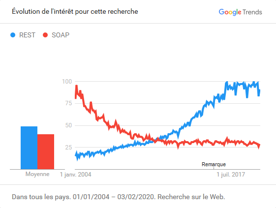
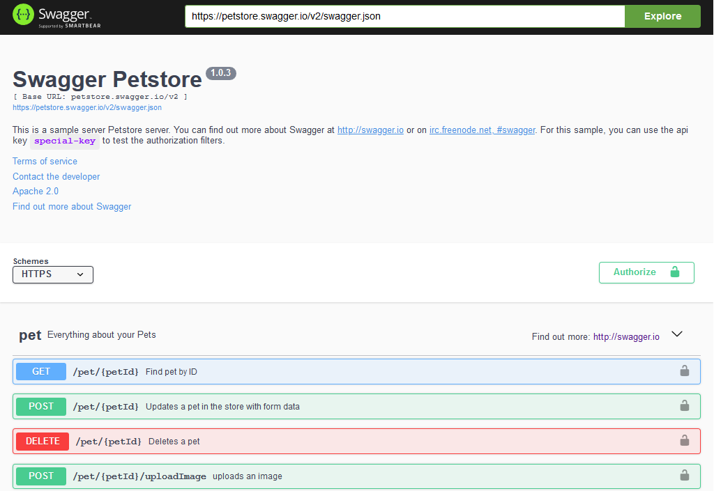

## L'art du code qui génère du code

Cette présentation est largement inspirée par

[{CODE2216E} The art of code that writes code](https://videos.vmworld.com/global/2019?q=The%2520Art%2520of%2520Code%2520That%2520Writes%2520Code)

Kyle Ruddy @ VMware Inc. <!-- .element style="font-size:0.8em; text-align: right" -->


## Notre programme

1. Les APIs nous envahissent
1. Anatomie d'un appel d'API REST
1. API: description et standardisation
1. Sortez les outils, on va jardiner
1. Démo: Votre SDK en 2 minutes ⏱!


## Les APIs nous envahissent
<!-- .slide: style="text-align:center;" -->




### Alors c'est quoi une API?

Une API est une interface de service:

* offerte par un logiciel
* à destination d'autres logiciels

Le but d'une API c'est de permettre une communication avec un langage commun.


### Les interface de programmation sont partout!

On retrouve des APIs dans toutes les interactions *M2M* (Machine to machine) du quotidien:

* Votre téléphone portable
* Une maison
* Une voiture
* Votre navigateur web
* …


### À travers des APIs, un logiciel…

* accède aux données d'une BDD
  * requête
  * envoie
* commande une action sur une autre machine
* donne des informations sur son état
  * de santé
  * de fonctionnement
* …


### Serveur / client

Dans un modèle de communication avec API:

* Un serveur
* Un/des client(s)
* Un contrat d'interface
  * Négocié entre client et serveur (ex: `Accept`+`Content-Type`)
  * Imposé par le serveur
    * Dans ce cas, le client doit être strictement compatible


### Serveur et client(s)
<!-- .slide: style="text-align:center;" -->

[<!-- .element style="min-width:75%;" -->](https://www.planttext.com/?text=TL4zJyCm4DtlLpnrWg8E5AOCgAWiR9KwjWnNvz96JSx1kI0gn7_7YUgq8E7fdj-z3ykBrZXOLrT4xR7KXWFNSBvkl8hQsawL8B9peeRTaVU2oLh2XuG9lWZnZBlOFAzUjxeAFk-SX3TmYmJecsWJWNddAsprvWuv6wFmeMQxJRi3VPMqhCfe_5_IqclRrUUa1FeaIW2psTFec-6UnWfdOYYNOKvf_gDu-Ar8lXaUOufw4rHI67nnQTytVRcy3OuLEyc6-oc2l7Tba1ox4vfhoHGgU-zAjaYM2Zi8vDCTMFT2eZdwDA957EDt_000)


### De XML-RPC à REST
<!-- .slide: style="text-align:center;" -->

Un rapide historique des APIs et *Web Services*


### XML-RPC

_**Ex**tensible **M**arkup **L**anguage - **R**emote **P**rocedure **C**all_

* Spécifications simples
* Format de données: XML
* Protocol de transport: HTTP `POST`
* Abstraction du système/langage utilisé coté serveur

[xmlrpc.com/spec.md](http://xmlrpc.com/spec.md)


### XML-RPC - exemple de requête
<!-- .slide: class="small_code" -->

```http
POST /RPC2 HTTP/1.0
Host: betty.userland.com
Content-Type: text/xml
Content-length: 181

<?xml version="1.0"?>
<methodCall>
  <methodName>examples.getStateName</methodName>
  <params>
    <param>
      <value>
        <int>41</int>
      </value>
    </param>
  </params>
</methodCall>
```


### XML-RPC - exemple de réponse
<!-- .slide: class="small_code" -->

```http
HTTP/1.1 200 OK
content-type: text/plain

<?xml version="1.0"?>
<methodResponse>
  <params>
    <param>
      <value>
        <string>South Dakota</string>
      </value>
    </param>
  </params>
</methodResponse>
```


### SOAP

_**S**imple **O**bject **A**ccess **P**rotocol_

* Version améliorée de XML-RPC
* Plus complexe et plus lourd
* Format de données: Grammaire XML formelle
* **WSDL** (*Web Services Description Language*)
* Protocol: Souvent HTTP mais agnostique (SMTP, AMQP…)

[www.w3.org/TR/soap](https://www.w3.org/TR/soap/)


### SOAP - exemple de requête
<!-- .slide: class="small_code" -->

```http
POST /calculator.asmx HTTP/1.1
Host: www.dneonline.com
Accept: */*
Content-Type: application/soap+xml; charset=utf-8
Content-Length: 353

<?xml version="1.0" encoding="utf-8"?>
<soap12:Envelope xmlns:xsi="http://www.w3.org/2001/XMLSchema-instance"
                 xmlns:xsd="http://www.w3.org/2001/XMLSchema"
                 xmlns:soap12="http://www.w3.org/2003/05/soap-envelope">
  <soap12:Body>
    <Add xmlns="http://tempuri.org/">
      <intA>1</intA>
      <intB>4</intB>
    </Add>
  </soap12:Body>
</soap12:Envelope>
```


### SOAP - exemple de réponse
<!-- .slide: class="small_code" -->

```http
HTTP/1.1 200 OK
Content-Length: 323
Content-Type: application/soap+xml; charset=utf-8

<?xml version="1.0" ?>
<soap:Envelope xmlns:soap="http://www.w3.org/2003/05/soap-envelope"
               xmlns:xsd="http://www.w3.org/2001/XMLSchema"
               xmlns:xsi="http://www.w3.org/2001/XMLSchema-instance">
  <soap:Body>
    <AddResponse xmlns="http://tempuri.org/">
      <AddResult>5</AddResult>
    </AddResponse>
  </soap:Body>
</soap:Envelope>
```


### REST

_**RE**presentational **S**tate **T**ransfer_

* Protocol de transport HTTP(s)
* S'appuie fortement sur la couche protocolaire:
  * URIs
  * Headers
  * HTTP codes…
* Agnostique du format des données: souvent XML ou JSON


### REST - exemple de requête

```http
POST /v4/ HTTP/1.1
Host: api.mathjs.org
Accept: */*
Content-Length: 20
Content-Type: application/json

{
  "expr":"2+4"
}
```


### REST - exemple de réponse

```http
HTTP/1.0 200 OK
Content-Type: application/json; charset=utf-8
Content-Length: 27

{
  "result": "6",
  "error": null
}
```


### REST vs (SOAP || XML-RPC)

* *Stateless*:
  * Chaque requête contient les informations nécessaires à son traitement
  * Meilleure tolérance aux pannes
  * On ne maintient pas une connexion pendant une suite d'échanges
* *Interface uniforme*:
  * Le découpage permet des évolutions progressives
  * Indépendance client/serveur


### REST à la conquête du monde
<!-- .slide: style="text-align:center;" -->

<!-- .element style="min-width:75%;" -->


## Anatomie d'un appel d'API REST


### Anatomie d'une requête REST/HTTP

```bash
curl https://restcountries.eu/rest/v2/name/Republ -vi
```

Devient (en gros):

```http
GET /rest/v2/name/Republ HTTP/2
Host: restcountries.eu
User-Agent: curl/7.58.0
Accept: */*
```


#### Méthodes HTTP

Les méthodes HTTP sont utilisées pour décrire le type d'action à réaliser avec l'API REST:

* `GET`: Obtenir une ressource en lecture
* `POST`: Envoyer des données (formulaire) et créer une ressource
* `PUT`: Modifier/Remplacer une ressource (on ré-envoie la totalité de la ressource)
* `PATCH`: Modifier une ressource en envoyant seulement la partie modifiée
* `DELETE`: Supprimer une ressource


#### URL/URi

Dans l'exemple précédent, l'URL permet, d'accéder à une ressource particulière:

**`/rest/v2/name/Republ`**:

* **`rest`**: le endpoint API
* **`v2`**: probablement un numéro de version
* **`name`**: permet d'effectuer une recherche sur le nom d'un pays
* **`Republ`**: le paramètre de la recherche

> Les paramètres peuvent aussi être indiqués via la forme suivante: `?key1=value1&key2=value2…`


#### Host, User-Agent et Accept

```http
Host: restcountries.eu
```

FQDN du serveur à atteindre. Selon sa valeur, un même serveur peut servir plusieurs services distincts.

```http
User-Agent: curl/7.58.0
```

En-tête indicatif mais permet des statistiques ou d'avoir des indications sur le client utilisé.

```http
Accept: */*
```

Permet au client d'indiquer le format de données attendue en réponse (sous réserve que ce format soit supporté par le serveur).


### Anatomie d'une réponse REST/HTTP

```http
HTTP/2 200
content-type: application/json;charset=utf-8
cache-control: public, max-age=86400
```


#### Les codes de réponse HTTP

* `1xx`: Information
* `2xx`: Succès (OK, Created, Accepted, No Content…)
* `3xx`: Redirections (ex: HTTP > HTTPS)
* `4xx`: Erreur du client web (Bad Request, Unauthorized, Forbidden, Not Found…)
* `5xx`: Erreur du serveur et ou du serveur d'application (Timeout, internal error…)


#### Content-type et cache-control

```http
content-type: application/json;charset=utf-8
```

Indique au client quel type de contenu a été généré: en général, le serveur essaie de s'accorder avec l'en-tête `Accept` de la requête.

```http
cache-control: public, max-age=86400
```

En-tête utilisé pour définir la politique de cache des contenus: type de cache, durée de validité etc.


#### Shake your **Body**, down to the ground

> RFC Jackson-Five, 1978

Dans une requête, le *body* permet d'envoyer:

* Le contenu d'un formulaire, ou des paramètres  de requête
* Des données à enregistrer ou utiliser (fichiers, contenu texte etc.)

Dans une réponse, le *body* contient généralement les données demandées ou générées pour une requête donnée.


## API: Description et standardisation
<!-- .slide: style="text-align:center;" -->
*Du moins, des tentatives*


### OpenAPI

L'_**O**pen **A**PI **I**nitiative_ a été initiée par la Linux Foundation sur les bases de Swagger:

Un modèle de description d'API REST en JSON qui décrit méthodes, headers, paramètres, body, réponses etc.


### OAS v3

**O**pen**A**PI **S**pecifications v3 (la version en cours depuis 2017) est à présent une norme de documentation qui supporte:

* À la fois le JSON ou le YAML
* Cycle de vie de l'application
* Liens entre opérations (RESTful)


### Swagger

Swagger est un framework open-source (initié par  *SmartBear*) dont les outils facilitent la conception, la description et l'usage d'API REST(ful).

Le produit le plus connu est Swagger UI qui permet de documenter et visualiser une API REST.


#### Swagger UI
<!-- .slide: style="text-align:center;" -->

<!-- .element style="min-width:75%;" -->


### Et la diversité?

Swagger/OpenAPI s'imposer petit à petit comme un standard. Mais…

Chacun fait un peu comme il l'entend et au final, beaucoup d'APIs ne sont pas documentées de cette manière, soit par antériorité, soit par choix volontaire…

La diversité permet aussi d'améliorer régulièrement le *standard* en se nourrissant des bonnes idées des autres!


### Reinventing the wheel
<!-- .slide: style="text-align:center;" -->

<!-- .element style="min-width:75%;" -->


## Sortez les outils, on va jardiner…


### De l'intérêt du standard

Avoir ou utiliser un standard présente quelques intérêts.

Notamment celui de bénéficier d'un écosystème:

* Dynamique
* Varié
* Fiabilisé par une communauté importante.


### OpenAPI ready frameworks

**Idée générale:** Insérer dans le code d'un serveur d'API, suffisament d'élements pour la documenter. La génération de la documentation en format OpenAPI est ensuite automatique.

**Exemples:**

* Flask-RESTPlus
* OpenAPI.NET SDK / Swashbuckle ASP.NET
* Springdoc-openapi
* …


### Génération automatique de clients

REST permet d'être agnostique du client utilisé mais:

> Qui voudrait maintenir un SDK en Python + un SDK en Go + en JAVA + .Net etc.?

Hors, pour des applications conséquentes, un package client permet d'accélérer l'adoption de l'API par ses utilisateurs.


### Le code qui génère du code

**Idée générale:** Utiliser le fichier descripteur de l'API pour générer des SDK:

* de manière totalement naïve
* uniquement basée sur le contenu du fichier OpenAPI
* dans le language choisi
* sans intervention humaine.

Le même principe peut être utilisé pour la génération de *bouchons* (Serveurs de test).


#### Exemples de librairies

* Azure/**Autorest**:
  * C#, PowerShell, Go, Java, Node.js, TypeScript, Python, Ruby et PHP
* Swagger **CodeGen**:
  * ada, ada-server, akka-scala, android, apache2, apex, aspnetcore, bash, csharp, clojure, cwiki, cpprest, csharp-dotnet2, dart, dart-jaguar, elixir, elm, eiffel, erlang-client, erlang-server, finch, flash, python-flask, go, go-server, groovy, haskell-http-client, haskell, jmeter, jaxrs-cxf-client, jaxrs-cxf, java, inflector, jaxrs-cxf-cdi, jaxrs-spec, jaxrs, msf4j, java-pkmst, java-play-framework, jaxrs-resteasy-eap, jaxrs-resteasy, javascript, javascript-closure-angular, java-vertx, kotlin, lua, lumen, nancyfx, nodejs-server, objc, perl, php, powershell, pistache-server, python, qt5cpp, r, rails5, restbed, ruby, rust, rust-server, scala, scala-gatling, scala-lagom-server, scalatra, scalaz, php-silex, sinatra, slim, spring, dynamic-html, html2, html, swagger, swagger-yaml, swift5, swift4, swift3, swift, php-symfony, tizen, typescript-aurelia, typescript-angular, typescript-inversify, typescript-angularjs, typescript-fetch, typescript-jquery, typescript-node, undertow, ze-ph, kotlin-server<!-- .element style="font-size:0.6em;" -->
* **OpenAPI Generator**


## Demo time !
<!-- .slide: data-background="#2E2E2E" data-state="nologo-slide" style="text-align: center;" -->
