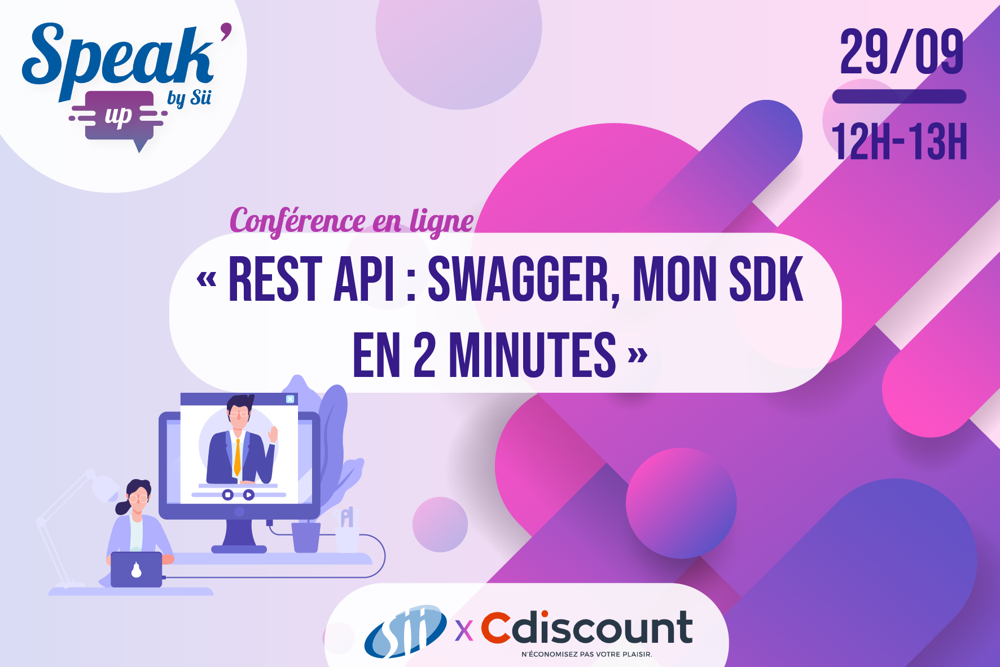
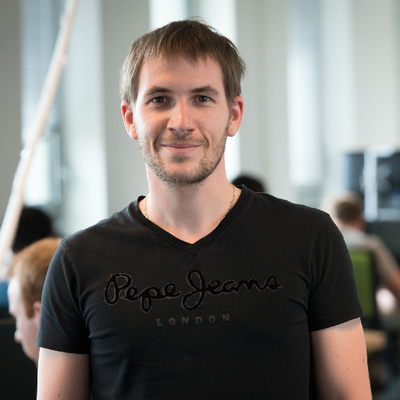

#  <!-- .element style="max-width:100%;" -->
<!--# REST ❤ Swagger, mon SDK en 2 minutes ⏱-->
<!-- .slide: data-state="nologo-slide" style="text-align: center; .slide: data-background="#FFFFFF" -->

## <!-- .element style="text-align: center; margin-top: -10%;" -->
<!-- .slide: data-state="nologo-slide" -->

* 10 000 collaborateurs dans 18 pays
* 88 sites dont 30 en France
  * Bordeaux: *📍* Mérignac
* Thématiques:
  * Aérospace & Défense
  * Finance
  * Télécom
  * Transport
* *« Great Place To Work »* depuis 2018

## <!-- .element style="text-align: center; width:150px; border: 1px solid grey; border-radius: 75px; margin-top: -10%;" -->
<!-- .slide: style="font-size:0.9em;" -->

Ingénieur Virtualisation et Cloud-computing:

* Aider nos clients dans les tâches d'**automatisation de leur datacenter**
* Conseiller vis-à-vis des **stratégies "Cloud"** à mettre en place
* **Former** (Cloud, OpenStack, Virtualisation)

**Communauté VMware Francophone**: speaker, vExpert Cloud Provider, Blog etc.

Twitter: [@lrivallain](https://twitter.com/lrivallain)
