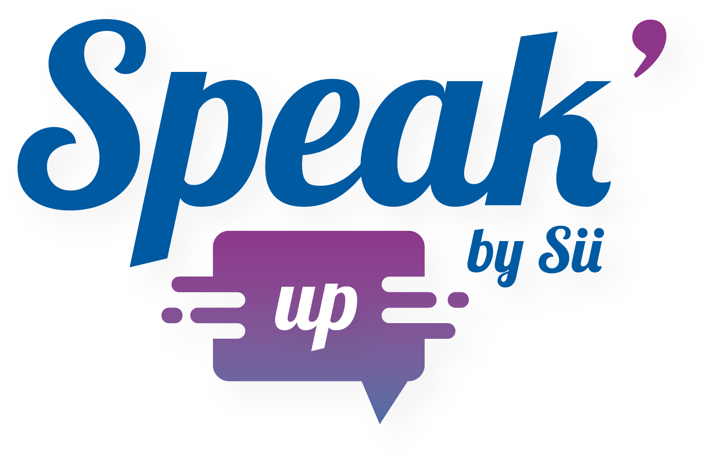
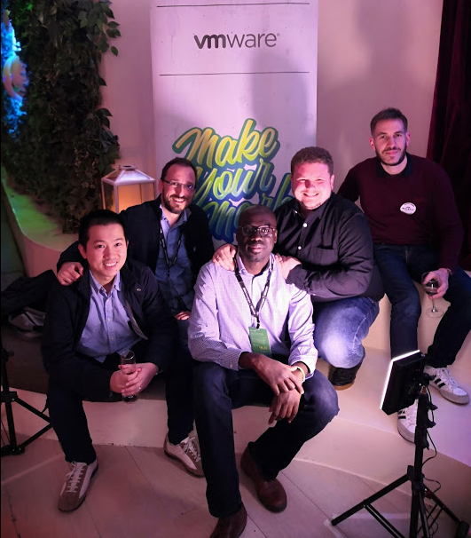

 <!-- .element style="max-width:40%;" -->
# REST ❤ Swagger, mon SDK en 2 minutes ⏱
<!-- .slide: data-state="nologo-slide" style="text-align: center;" -->

## Le VMworld

<!-- .slide: style="text-align:center;" -->
 <!-- .element style="max-width:45%;" -->

## Le VMworld en général

* 4 jours de conférences
* De nombreux sponsors et partenaires participent à l'organisation
* Des évènements en *'off'*
  * Soirées
  * Rencontres (par pays, expertises, intérêts…)
  * Hackathon
  * …

## VMworld US

* Depuis 2004 (*@* San Diego)
* 1 500 personnes à la première édition
* A présent:
  * *@* San Francisco
  * 25 000 personnes (2019)

## VMworld Europe (EUMA)

* 11 éditions
* *@* Cannes, Copenhague puis Barcelone
  * Fira de Barcelona (200 000m²)
* 14 000 personnes (2019)

## Conférences

* 480+ sessions proposées
* Types de conférences:
  * *Plénières*: Annonces !
  * *Keynotes*: Vision, Rex clients
  * *Breakout* et *Deep dive*: Technique
* Un *Partner-Solutions-Exchange* (100+ exposants)
* Hands on labs (250 postes)
* …